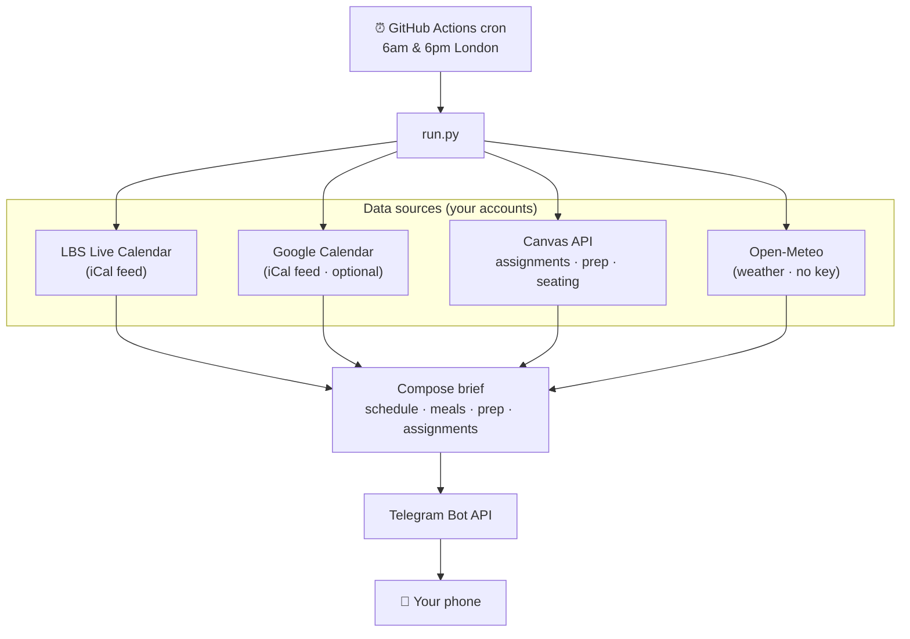

# 📚 LBS Canvas → Telegram daily brief

A free, self-hosted bot that texts you a **morning and evening brief** built from your
LBS Canvas calendar — so you walk into each day knowing your classes, where to sit, what
to prep, what's due, and even how to plan your meals around the timetable.

It runs entirely on **GitHub Actions** (free) — no server, no cost, and it keeps working
even when your laptop is off.

> Built by an LBS MBA student for classmates. **Unofficial** — not affiliated with or
> endorsed by London Business School. You run it with your own accounts and tokens.

---

## What you get

Two Telegram messages a day (times configurable, default 6am & 6pm London):

```
🌙 Tomorrow — Mon 17 Aug
⛅ 20–26°C

🗓️ Classes & events
🎓 08:15–11:00  Understanding General Management · Sammy Ofer Centre (LT15) · 🪑 seating chart

🍽️ Meal planning
🍳 Early start (08:15) — prep tonight or grab something quick
🥪 Done by 11:00 — lunch is all yours
🍽️ Free evening — good chance to cook something proper

📖 Prep for tomorrow
Understanding General Management · Session 1 — The Challenge
📄 Honda (A)
   1. Why was Honda so successful in invading the US motorcycle market?
   2. …

📚 Assignments
• 🔴 Individual Assignment 1 — OVERDUE — was due 08:15
• 🟠 Your LBS CV — due tomorrow 12:00
• 🟢 Individual Assignment 2 — due Wed 16:00 · in 3d · Major
```

### Features

- **🗓️ Your real timetable** — classes, tutorials, exams, plus Programme Office & Career
  Centre events, from your personal LBS Live Calendar feed (already filtered to your stream).
- **📅 Personal calendar merge** — optionally fold in your Google Calendar (club events,
  socials, birthdays) so the brief reflects your whole day.
- **🪑 Seating charts** *(MBA)* — each class links to your stream's per-room seating chart.
- **📖 Pre-session prep** — the readings/case links and prep questions your professors
  publish per session, surfaced the night before (and morning of).
- **📚 Smart assignments** — due dates *and times*, with live status: `submitted`,
  `OVERDUE`, `due today 14:00`, `in 3d`. Bigger assignments are flagged earlier.
- **🍽️ Meal planning** — breakfast/lunch/dinner suggestions from the shape of your day;
  recognises food events (BBQ, reception) as sorting a meal for you.
- **🌦️ Weather** — a forecast line, with a nudge to eat inside if it'll rain over lunch.

---

## How it works



Everything is **stateless**: each run fetches live data, sends one message, and forgets.
Secrets live only in GitHub Actions secrets — never in the code.

| Concern | Choice |
|---|---|
| Schedule source | LBS Live Calendar iCal (richer & pre-filtered vs the Canvas calendar) |
| Assignments / prep / seating | Canvas REST API |
| Weather | [Open-Meteo](https://open-meteo.com) — free, no API key |
| Delivery | Telegram bot (free, unlimited, no business setup) |
| Hosting | GitHub Actions cron (free tier is plenty) |

---

## Setup — no coding required (~15 min)

You don't need to know how to code. It runs on GitHub's servers; you just paste in a few
personal keys. (A "run it on your laptop" path for tinkerers is at the very bottom.)

### Step 1 — Make your own copy
Click the green **Use this template** button at the top of this page → **Create a new
repository** → give it a name (e.g. `my-lbs-brief`) → **Create repository**. You now have
your own copy under your GitHub account.

### Step 2 — Collect your keys
Do these in your **web browser** (except Telegram, which is the **phone app**). Gather the
values into a notes app. Each is a secret — don't share or post them.

**a) Canvas access token** — proves it's you to Canvas.
- Go to [learning.london.edu](https://learning.london.edu) → click your avatar → **Settings**.
- Scroll to **Approved Integrations** → **+ New Access Token** → purpose "daily brief" →
  **Generate Token**.
- **Copy it right away** (you can't see it again). Looks like `5886~AbCdEf...` — a number,
  a `~`, then a long string.

**b) LBS calendar link** — your personal timetable feed.
- Go to the [LBS calendar site](https://lbscalendar.london.edu) → click **More options**
  (the `…`) → **Subscribe** → **copy the link**.
- Looks like `https://lbscalendar.london.edu/api/student/subscription/xxxxxxxx-...`

**c) Telegram bot token** — 📱 *in the Telegram phone app*.
- Install **Telegram** on your phone if you haven't. Open the app → tap the search icon →
  find **[@BotFather](https://t.me/BotFather)** (it has a blue tick).
- Send it `/newbot` → follow the prompts (a name, then a username ending in `bot`).
- BotFather replies with a token like `8845113781:AAH9E9...`. Tap it to copy.

**d) Telegram chat ID** — so the bot messages *you*.
1. 📱 In the Telegram app, open **your new bot** and send it any message (e.g. "hi").
   *This step matters — the next one only works after your bot has received a message.*
2. In your **browser**, go to the address below, replacing `<YOUR_BOT_TOKEN>` with the token
   from step (c) — keep the word `bot` directly in front of it:
   `https://api.telegram.org/bot<YOUR_BOT_TOKEN>/getUpdates`
   So it ends up looking like `https://api.telegram.org/bot8845113781:AAH.../getUpdates`.
3. The page shows some text (JSON). Find `"chat":{"id":123456789,` — the number after
   `"id":` is your chat ID (just digits, occasionally with a leading `-`).
4. If it shows `{"ok":true,"result":[]}` (empty), you haven't messaged the bot yet — do
   step 1, then refresh the page.

**e) Google Calendar link** *(optional)* — to fold in personal events.
- In your browser at [Google Calendar](https://calendar.google.com) → hover your calendar →
  **⋮ → Settings and sharing → Integrate calendar** → copy **Secret address in iCal format**
  (the `.../private-.../basic.ics` one — **not** the public one).

### Step 3 — Add everything as ONE secret
No fiddly list of field names to remember — you paste a single block.

1. Copy the block below into a notes app and fill in each value after the `=`
   (leave a line blank if you're not using it — don't change the names on the left):

   ```
   CANVAS_BASE_URL=https://learning.london.edu
   CANVAS_TOKEN=
   LBS_CALENDAR_URL=
   TELEGRAM_BOT_TOKEN=
   TELEGRAM_CHAT_ID=
   GOOGLE_CALENDAR_URL=
   SEATING_STREAM=
   ```

2. In **your** repo (in the browser), open **Settings → Secrets and variables → Actions**.
   *Tip: open it in a new browser tab so this guide stays put.* Click **New repository secret**.
3. **Name:** type `DOTENV`. **Secret:** paste your whole filled-in block. Click **Add secret**.

**Notes:**
- Fill in only the part **after** each `=`. No quotes, no extra spaces.
- `SEATING_STREAM` (LBS MBA only): your stream written in full, e.g. `Stream E`. Leave blank
  if you're not MBA or don't want seating links.
- `GOOGLE_CALENDAR_URL` is optional — leave it blank to skip it.

### Step 4 — Turn it on & check it
1. Open the **Actions** tab of your repo → if asked, click **"I understand my workflows,
   go ahead and enable them"** (GitHub pauses workflows on new copies by default).
2. **Check your setup:** click **Check setup** (left) → **Run workflow**. In ~1 minute it
   reports each service and sends a test message to your phone:
   ```
   Canvas         ✅  Your Name
   LBS calendar   ✅  193 events found
   Telegram bot   ✅  @your_bot
   Telegram send  ✅  test message sent — check your phone
   ```
   Any ❌ tells you exactly what to fix (e.g. "token rejected — check CANVAS_TOKEN"). Edit
   your `DOTENV` secret and run it again until it's all ✅.
3. You're done! It now runs automatically at **6am and 6pm London**, every day — no laptop
   needed. £0. *(To see a full brief right now, run **Daily schedule brief** → **evening**.)*

### Troubleshooting
- **Start with "Check setup"** (Actions → **Check setup** → Run workflow) — it pinpoints
  which service is misconfigured instead of leaving you guessing.
- **"DOTENV secret not set / incomplete"** → your `DOTENV` secret is missing a required line
  (`CANVAS_TOKEN`, `LBS_CALENDAR_URL`, or the Telegram ones). Edit the secret and re-run.
- **Wrong values?** Just edit the single `DOTENV` secret (Settings → Secrets → `DOTENV` →
  update) — no need to hunt through several secrets.
- **Manual test worked but nothing at 6am** → GitHub's scheduler can run a few minutes late;
  it still sends once. Give it a day.

---

## Customising

Behaviour knobs live at the top of [`canvas_agent/config.py`](canvas_agent/config.py):
meal windows, break threshold, assignment effort tiers/keywords, and the seating term
section. Send times are the cron in [`.github/workflows/daily.yml`](.github/workflows/daily.yml)
plus the tolerant window in [`canvas_agent/run.py`](canvas_agent/run.py).

**Seating charts** are MBA-specific and optional — set `SEATING_STREAM` to your stream
(e.g. `Stream E`) to enable them; leave it blank and everything else still works.

**Not a coder?** You don't have to hand-edit anything. Point an AI coding tool at your
copy — [Claude Code](https://www.anthropic.com/claude-code), Cursor, GitHub Copilot, etc.
— and just describe what you want ("add a gym-class reminder", "change the send time to
7am", "put weather at the bottom"). It'll make the edit for you. This whole project was
built that way. 🙂

## Optional: run it on your laptop

Only needed if you want to change the code. Requires **Python 3.10+**.

```bash
git clone https://github.com/<your-username>/<your-repo>.git
cd <your-repo>
pip install -r requirements.txt
cp .env.example .env      # then open .env and fill in your keys (see below)
python -m canvas_agent.run --which evening --dry-run   # prints the brief, doesn't send
python -m canvas_agent.run --which evening              # actually sends to Telegram
pytest                                                  # run the tests
```

The `.env` file is exactly the block you put in the `DOTENV` secret — one `KEY=value` per
line, **no quotes** (e.g. `CANVAS_TOKEN=5886~AbCd...`). It's gitignored, so it never gets
committed. This laptop path only runs while your laptop is on — GitHub Actions is what
makes it reliable.

## Reliability notes

GitHub cron runs in UTC and can fire over an hour late, so the workflow uses a tolerant
London window plus a per-day cache marker (and `concurrency`) to send each brief **once**
even across the two DST-bracket crons.

**Keep-alive:** GitHub automatically switches off a repo's scheduled workflows after
**60 days with no commits** — and setting secrets or running the bot don't count as
commits. So this template ships with a second workflow,
[`.github/workflows/keepalive.yml`](.github/workflows/keepalive.yml), that makes one tiny
commit a month to reset that clock. **You get it automatically when you use the template**,
running in your own repo — nothing to set up. It's why your briefs keep coming without you
ever touching the repo. You'll see a monthly `chore: keep-alive` commit in your history;
that's expected. If you'd rather not have it, delete that file — just know you may then
need to re-enable the schedule (Actions tab → **Enable workflow**) if it ever goes quiet
for two months.

## Security & privacy

- Secrets go in GitHub Actions secrets or a local gitignored `.env` — **never** in code.
- Everything talks only to LBS/Canvas, Telegram, Google, and Open-Meteo — your own accounts.
- The bot only ever messages **you** (your chat id).

## Contributing

PRs welcome — especially adapters for other LBS programmes (MiF, MAM, Sloan…) or other
schools' Canvas/calendar setups. Open an issue with a sample of your calendar/Canvas
structure and we'll figure out the mapping.

## License

[MIT](LICENSE) — do what you like, no warranty. You are responsible for your own
credentials and for complying with LBS's acceptable-use policies.
