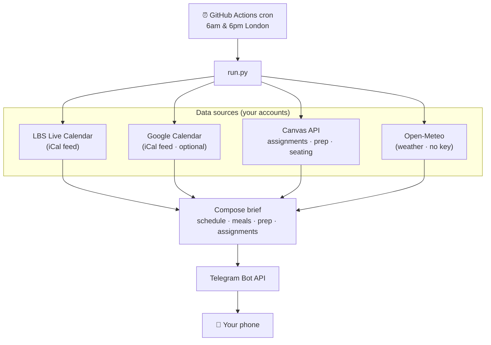

# 📚 LBS Canvas → Telegram daily brief

A free, self-hosted bot that texts you a **morning and evening brief** built from your
LBS Canvas calendar — so you walk into each day knowing your classes, where to sit, what
to prep, what's due, and even how to plan your meals around the timetable.

It runs entirely on **GitHub Actions** (free) — no server, no cost, and it keeps working
even when your laptop is off.

> Built by an LBS MBA student for classmates. **Unofficial** — not affiliated with or
> endorsed by London Business School. You run it with your own accounts and tokens.

---

## What you get

Two Telegram messages a day (times configurable, default 6am & 6pm London):

```
🌙 Tomorrow — Mon 17 Aug
⛅ 20–26°C

🗓️ Classes & events
🎓 08:15–11:00  Understanding General Management · Sammy Ofer Centre (LT15) · 🪑 seating chart

🍽️ Meal planning
🍳 Early start (08:15) — prep tonight or grab something quick
🥪 Done by 11:00 — lunch is all yours
🍽️ Free evening — good chance to cook something proper

📖 Prep for tomorrow
Understanding General Management · Session 1 — The Challenge
📄 Honda (A)
   1. Why was Honda so successful in invading the US motorcycle market?
   2. …

📚 Assignments
• 🔴 Individual Assignment 1 — OVERDUE — was due 08:15
• 🟠 Your LBS CV — due tomorrow 12:00
• 🟢 Individual Assignment 2 — due Wed 16:00 · in 3d · Major
```

### Features

- **🗓️ Your real timetable** — classes, tutorials, exams, plus Programme Office & Career
  Centre events, from your personal LBS Live Calendar feed (already filtered to your stream).
- **📅 Personal calendar merge** — optionally fold in your Google Calendar (club events,
  socials, birthdays) so the brief reflects your whole day.
- **🪑 Seating charts** *(MBA)* — each class links to your stream's per-room seating chart.
- **📖 Pre-session prep** — the readings/case links and prep questions your professors
  publish per session, surfaced the night before (and morning of).
- **📚 Smart assignments** — due dates *and times*, with live status: `submitted`,
  `OVERDUE`, `due today 14:00`, `in 3d`. Bigger assignments are flagged earlier.
- **🍽️ Meal planning** — breakfast/lunch/dinner suggestions from the shape of your day;
  recognises food events (BBQ, reception) as sorting a meal for you.
- **🌦️ Weather** — a forecast line, with a nudge to eat inside if it'll rain over lunch.

---

## How it works



Everything is **stateless**: each run fetches live data, sends one message, and forgets.
Secrets live only in GitHub Actions secrets — never in the code.

| Concern | Choice |
|---|---|
| Schedule source | LBS Live Calendar iCal (richer & pre-filtered vs the Canvas calendar) |
| Assignments / prep / seating | Canvas REST API |
| Weather | [Open-Meteo](https://open-meteo.com) — free, no API key |
| Delivery | Telegram bot (free, unlimited, no business setup) |
| Hosting | GitHub Actions cron (free tier is plenty) |

---

## Setup — no coding required (~15 min)

You don't need to know how to code. It runs on GitHub's servers; you just paste in a few
personal keys. (A "run it on your laptop" path for tinkerers is at the very bottom.)

### Step 1 — Make your own copy
Click the green **Use this template** button at the top of this page → **Create a new
repository** → give it a name (e.g. `my-lbs-brief`) → **Create repository**. You now have
your own copy under your GitHub account.

> 📸 *Screenshot: the "Use this template" button (see [Adding screenshots](#-adding-screenshots) to contribute one)*

### Step 2 — Collect your keys
Gather these into a notes app for a minute. Each is a secret — don't share or post them.

**a) Canvas access token** — proves it's you to Canvas.
- Go to **learning.london.edu** → click your avatar → **Settings**.
- Scroll to **Approved Integrations** → **+ New Access Token** → purpose "daily brief" →
  **Generate Token**.
- **Copy it right away** (you can't see it again). Looks like `5886~AbCdEf...` — a number,
  a `~`, then a long string.

> 📸 *Screenshot: the "New Access Token" button*

**b) LBS calendar link** — your personal timetable feed.
- Open the LBS calendar site → click **More options** (the `…`) → **Subscribe** →
  **copy the link**.
- Looks like `https://lbscalendar.london.edu/api/student/subscription/xxxxxxxx-...`

> 📸 *Screenshot: More options → Subscribe*

**c) Telegram bot token** — your own bot.
- In Telegram, search **@BotFather** → send `/newbot` → follow the prompts (a name, then a
  username ending in `bot`).
- It replies with a token like `8845113781:AAH9E9...` — digits, a colon, a long string. Copy it.

**d) Telegram chat ID** — so the bot messages *you*.
- Send your new bot any message (e.g. "hi") in Telegram.
- In a web browser, open this (paste your bot token where shown, keep the word `bot` in front):
  `https://api.telegram.org/bot<YOUR_BOT_TOKEN>/getUpdates`
- In the text that appears, find `"chat":{"id":123456789` — that number is your chat ID
  (just digits, occasionally with a leading `-`).

**e) Google Calendar link** *(optional)* — to fold in personal events.
- Google Calendar on a computer → hover your calendar → **⋮ → Settings and sharing →
  Integrate calendar** → copy **Secret address in iCal format** (the `.../private-.../basic.ics`
  one — **not** the public one).

### Step 3 — Paste the keys into GitHub ("Secrets")
This is where your keys live — encrypted, never shown in the code.

1. In **your** repo → **Settings** (top tab) → **Secrets and variables → Actions** (left).
2. Click **New repository secret**, then add each row below (Name exactly as written,
   Secret = your value). Repeat for each.

| Name (type exactly) | Value | Required |
|---|---|---|
| `CANVAS_BASE_URL` | `https://learning.london.edu` | ✅ |
| `CANVAS_TOKEN` | your Canvas token (`5886~...`) | ✅ |
| `LBS_CALENDAR_URL` | your calendar link | ✅ |
| `TELEGRAM_BOT_TOKEN` | your bot token (`8845...:AAH...`) | ✅ |
| `TELEGRAM_CHAT_ID` | your chat ID (digits) | ✅ |
| `GOOGLE_CALENDAR_URL` | your Google secret link | optional |
| `SEATING_STREAM` | your stream, e.g. `Stream C` (MBA only) | optional |

**Format rules — get these right:**
- Paste the value **raw**: no surrounding quotes, no spaces before/after, nothing extra.
- Names are **case-sensitive** — copy them exactly (all caps, underscores).
- `CANVAS_BASE_URL` has **no** trailing slash. `TELEGRAM_CHAT_ID` is **just the number**.

> 📸 *Screenshot: the "New repository secret" form*

### Step 4 — Turn it on
1. Open the **Actions** tab of your repo → if asked, click **"I understand my workflows,
   go ahead and enable them"** (GitHub pauses workflows on new copies by default).
2. Click **Daily schedule brief** (left) → **Run workflow** (right) → choose **evening** →
   **Run workflow**.
3. Wait ~1 minute, then check Telegram — you should get a brief! 🎉

From now on it runs itself at **6am and 6pm London**, every day, no laptop needed. £0.

### Troubleshooting
- **No message?** Actions tab → open the latest run → look for a red ✗ and read the error.
- **"Missing required environment variables"** → a required secret is missing or misspelled
  (names are case-sensitive).
- **Manual test worked but nothing at 6am** → GitHub's scheduler can run a few minutes late;
  it still sends once. Give it a day.

---

## 📸 Adding screenshots

Screenshots make this guide far easier to follow — contributions welcome! The easiest way:
1. Take the screenshot (blur out anything personal).
2. On GitHub, open `README.md` and click the **✏️ pencil** to edit → **drag your image file
   straight into the text box**. GitHub uploads it and inserts the link automatically.
3. Drop it where you see a `📸 Screenshot: …` line, and delete that placeholder line.

(Or add files under `docs/images/` and reference them as ``.)

---

## Customising

Behaviour knobs live at the top of [`canvas_agent/config.py`](canvas_agent/config.py):
meal windows, break threshold, assignment effort tiers/keywords, and the seating term
section. Send times are the cron in [`.github/workflows/daily.yml`](.github/workflows/daily.yml)
plus the tolerant window in [`canvas_agent/run.py`](canvas_agent/run.py).

**Seating charts** are MBA-specific and optional — set `SEATING_STREAM` to your stream
(e.g. `Stream C`) to enable them; leave it blank and everything else still works.

## Optional: run it on your laptop

Only needed if you want to change the code. Requires **Python 3.10+**.

```bash
git clone https://github.com/<your-username>/<your-repo>.git
cd <your-repo>
pip install -r requirements.txt
cp .env.example .env      # then open .env and fill in your keys (see below)
python -m canvas_agent.run --which evening --dry-run   # prints the brief, doesn't send
python -m canvas_agent.run --which evening              # actually sends to Telegram
pytest                                                  # run the tests
```

The `.env` file holds the **same keys** as your GitHub Secrets, one per line, `KEY=value`
with **no quotes** — e.g. `CANVAS_TOKEN=5886~AbCd...`. It's gitignored, so it never gets
committed. This laptop path only runs while your laptop is on — GitHub Actions is what
makes it reliable.

## Reliability notes

GitHub cron runs in UTC and can fire over an hour late, so the workflow uses a tolerant
London window plus a per-day cache marker (and `concurrency`) to send each brief **once**
even across the two DST-bracket crons. A monthly keep-alive commit stops GitHub
auto-disabling the schedule after 60 days of repo inactivity.

## Security & privacy

- Secrets go in GitHub Actions secrets or a local gitignored `.env` — **never** in code.
- Everything talks only to LBS/Canvas, Telegram, Google, and Open-Meteo — your own accounts.
- The bot only ever messages **you** (your chat id).

## Contributing

PRs welcome — especially adapters for other LBS programmes (MiF, MAM, Sloan…) or other
schools' Canvas/calendar setups. Open an issue with a sample of your calendar/Canvas
structure and we'll figure out the mapping.

## License

[MIT](LICENSE) — do what you like, no warranty. You are responsible for your own
credentials and for complying with LBS's acceptable-use policies.
