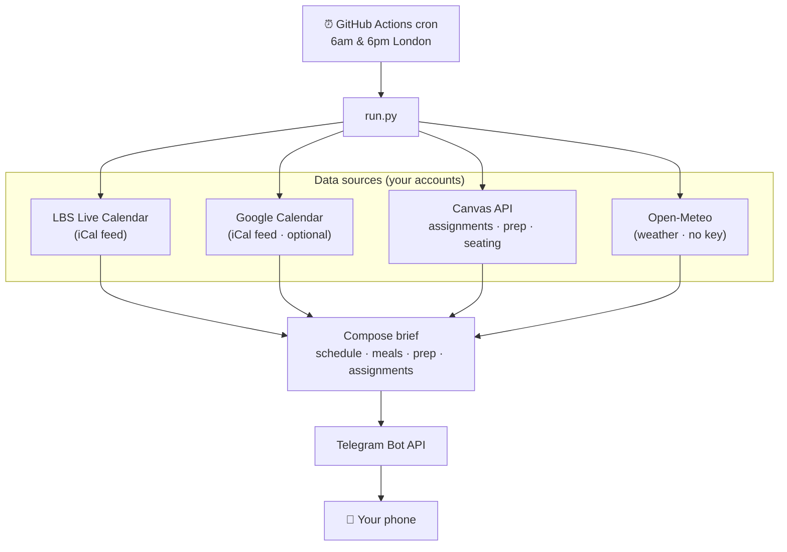

# 📚 LBS Canvas → Telegram daily brief

A free, self-hosted bot that texts you a **morning and evening brief** built from your
LBS Canvas calendar — so you walk into each day knowing your classes, where to sit, what
to prep, what's due, and even how to plan your meals around the timetable.

It runs entirely on **GitHub Actions** (free) — no server, no cost, and it keeps working
even when your laptop is off.

> Built by an LBS MBA student for classmates. **Unofficial** — not affiliated with or
> endorsed by London Business School. You run it with your own accounts and tokens.

---

## What you get

Two Telegram messages a day (times configurable, default 6am & 6pm London):

```
🌙 Tomorrow — Mon 17 Aug
⛅ 20–26°C

🗓️ Classes & events
🎓 08:15–11:00  Understanding General Management · Sammy Ofer Centre (LT15) · 🪑 seating chart

🍽️ Meal planning
🍳 Early start (08:15) — prep tonight or grab something quick
🥪 Done by 11:00 — lunch is all yours
🍽️ Free evening — good chance to cook something proper

📖 Prep for tomorrow
Understanding General Management · Session 1 — The Challenge
📄 Honda (A)
   1. Why was Honda so successful in invading the US motorcycle market?
   2. …

📚 Assignments
• 🔴 Individual Assignment 1 — OVERDUE — was due 08:15
• 🟠 Your LBS CV — due tomorrow 12:00
• 🟢 Individual Assignment 2 — due Wed 16:00 · in 3d · Large
```

### Features

- **🗓️ Your real timetable** — classes, tutorials, exams, plus Programme Office & Career
  Centre events, from your personal LBS Live Calendar feed (already filtered to your stream).
- **📅 Personal calendar merge** — optionally fold in your Google Calendar (club events,
  socials, birthdays) so the brief reflects your whole day.
- **🪑 Seating charts** *(MBA)* — each class links to your stream's per-room seating chart.
- **📖 Pre-session prep** — the readings/case links and prep questions your professors
  publish per session, surfaced the night before (and morning of).
- **📚 Smart assignments** — due dates *and times*, with live status: `submitted`,
  `OVERDUE`, `due today 14:00`, `in 3d`. Bigger assignments are flagged earlier.
- **🍽️ Meal planning** — breakfast/lunch/dinner suggestions from the shape of your day;
  recognises food events (BBQ, reception) as sorting a meal for you.
- **🌦️ Weather** — a forecast line, with a nudge to eat inside if it'll rain over lunch.

---

## How it works



Everything is **stateless**: each run fetches live data, sends one message, and forgets.
Secrets live only in GitHub Actions secrets — never in the code.

| Concern | Choice |
|---|---|
| Schedule source | LBS Live Calendar iCal (richer & pre-filtered vs the Canvas calendar) |
| Assignments / prep / seating | Canvas REST API |
| Weather | [Open-Meteo](https://open-meteo.com) — free, no API key |
| Delivery | Telegram bot (free, unlimited, no business setup) |
| Hosting | GitHub Actions cron (free tier is plenty) |

---

## Setup (about 15 minutes)

### 1. Use this template
Click **Use this template** (or fork), then clone your copy.

### 2. Get your credentials

<details><summary><b>Canvas access token</b></summary>

On `learning.london.edu`: **Account → Settings → Approved Integrations → + New Access
Token**. Copy it now (you can't see it again). Treat it like a password.
</details>

<details><summary><b>LBS Live Calendar feed URL</b></summary>

On the LBS calendar site, find **Subscribe / Calendar feed** and copy the personal
`https://lbscalendar.london.edu/api/student/subscription/…` URL. It's secret — anyone
with it can read your calendar.
</details>

<details><summary><b>Telegram bot + chat id</b></summary>

1. In Telegram, message **@BotFather** → `/newbot` → copy the bot token.
2. Send your new bot any message (e.g. "hi").
3. Run `python scripts/get_chat_id.py` (with `TELEGRAM_BOT_TOKEN` set) → it prints your
   chat id.
</details>

<details><summary><b>Google Calendar feed (optional)</b></summary>

Google Calendar (web) → the calendar's **Settings and sharing → Integrate calendar →
"Secret address in iCal format"** (the `private-…` one, *not* Public).
</details>

### 3. Try it locally
```bash
pip install -r requirements.txt
cp .env.example .env        # then fill in your values
python -m canvas_agent.run --which evening --dry-run   # prints, doesn't send
python -m canvas_agent.run --which morning              # actually sends
pytest                                                  # run the tests
```

### 4. Deploy on GitHub Actions
1. Push your repo to GitHub.
2. **Settings → Secrets and variables → Actions** → add each as a secret:
   `CANVAS_BASE_URL`, `CANVAS_TOKEN`, `LBS_CALENDAR_URL`, `TELEGRAM_BOT_TOKEN`,
   `TELEGRAM_CHAT_ID`, and optionally `GOOGLE_CALENDAR_URL`, `SEATING_STREAM`.
3. **Actions** tab → enable workflows → run **Daily schedule brief** manually
   (`workflow_dispatch`) to test. The cron then runs automatically.

That's it — £0, and it survives your laptop being closed.

---

## Customising

Behaviour knobs live at the top of [`canvas_agent/config.py`](canvas_agent/config.py):
meal windows, break threshold, assignment effort tiers/keywords, and the seating term
section. Send times are the cron in [`.github/workflows/daily.yml`](.github/workflows/daily.yml)
plus the tolerant window in [`canvas_agent/run.py`](canvas_agent/run.py).

**Seating charts** are MBA-specific and optional — set `SEATING_STREAM` to your stream
(e.g. `Stream C`) to enable them; leave it blank and everything else still works.

## Reliability notes

GitHub cron runs in UTC and can fire over an hour late, so the workflow uses a tolerant
London window plus a per-day cache marker (and `concurrency`) to send each brief **once**
even across the two DST-bracket crons. A monthly keep-alive commit stops GitHub
auto-disabling the schedule after 60 days of repo inactivity.

## Security & privacy

- Secrets go in GitHub Actions secrets or a local gitignored `.env` — **never** in code.
- Everything talks only to LBS/Canvas, Telegram, Google, and Open-Meteo — your own accounts.
- The bot only ever messages **you** (your chat id).

## Contributing

PRs welcome — especially adapters for other LBS programmes (MiF, MAM, Sloan…) or other
schools' Canvas/calendar setups. Open an issue with a sample of your calendar/Canvas
structure and we'll figure out the mapping.

## License

[MIT](LICENSE) — do what you like, no warranty. You are responsible for your own
credentials and for complying with LBS's acceptable-use policies.
